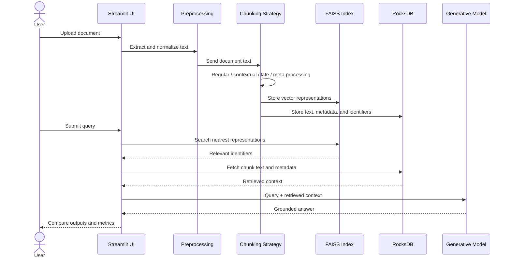

# System Architecture

## End-to-end flow

The project used a shared ingestion and retrieval architecture so the same uploaded documents could be processed through multiple chunking strategies and compared in one interface.

## Core components

### Document ingestion

The interface accepted uploaded text documents and initialized the reusable retrieval structures. A shared data source helped make comparisons more consistent across strategies.

### Chunking layer

The architecture supported four processing paths:

- Regular chunking
- Contextual retrieval
- Late chunking
- Meta-chunking

Each strategy transformed the same source material differently before retrieval.

### Retrieval layer

FAISS supported similarity search over document representations. RocksDB stored persistent text, metadata, and index-linked records needed to reconstruct retrieved context.

### Generation layer

The team initially experimented with Qwen, but generation could take up to approximately 20 minutes for one answer in the available environment. The project then used an OpenAI API-based model for a more responsive interactive workflow. Llama-3.2-1B-Instruct was also used in the contextual-retrieval path to generate contextual descriptions.

### Comparison interface

The Streamlit interface displayed strategy descriptions, outputs, processing time, and memory measurements in a side-by-side layout.
